# Notes App Simple
Simple notes application
# Preview
Download apk: https://www.mediafire.com/file/vimxlj2vrdipdfn/NotesApp.apk/file
<table style="width:100%">
  <tr>
    <th></th>
    <th></th>
    <th></th>
    <th></th>
  </tr>
  <tr>
    <td></td>
    <td>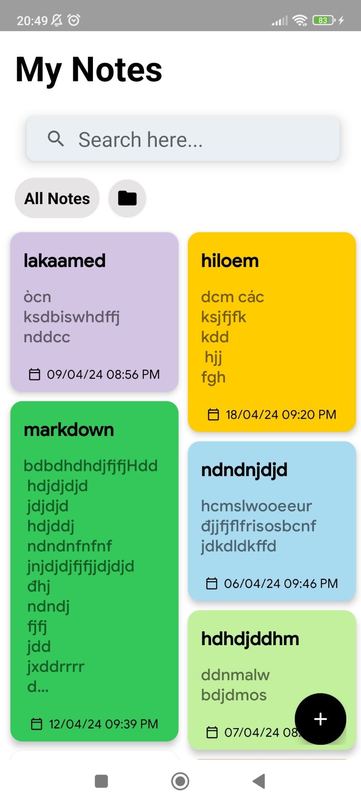</td>
    <td>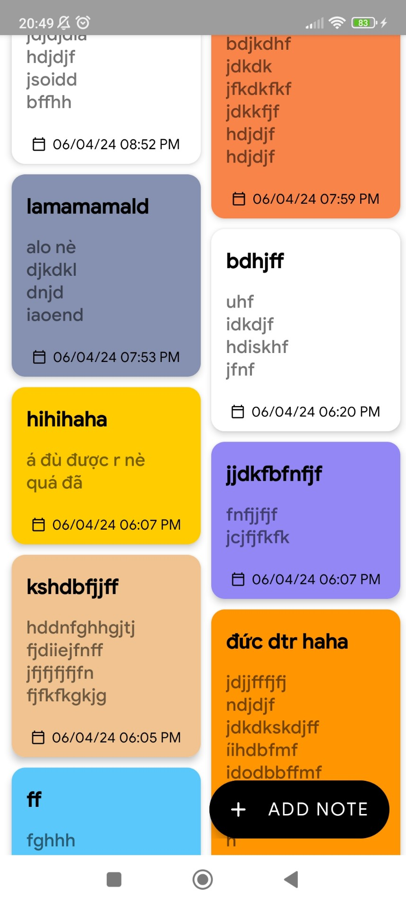</td>
    <td>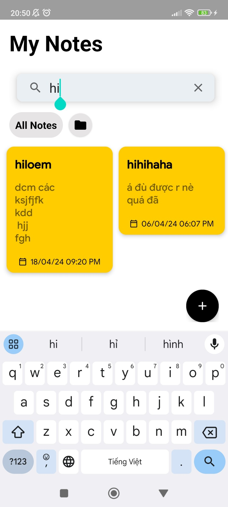</td>
  </tr>
   <tr>
      <th></th>
      <th></th>
      <th></th>
      <th></th>
    </tr>
    <tr>
      <td>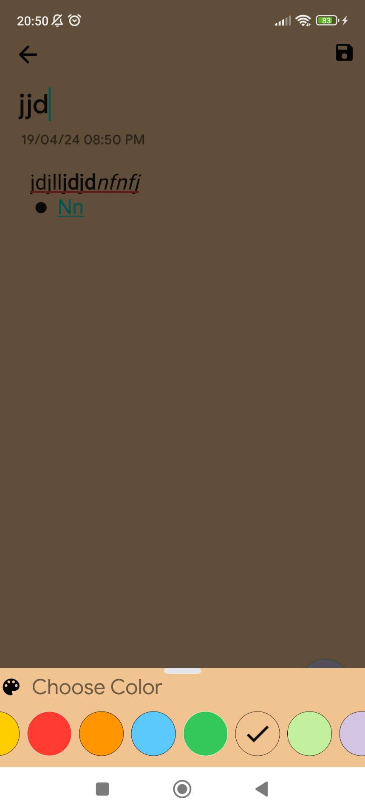</td>
      <td>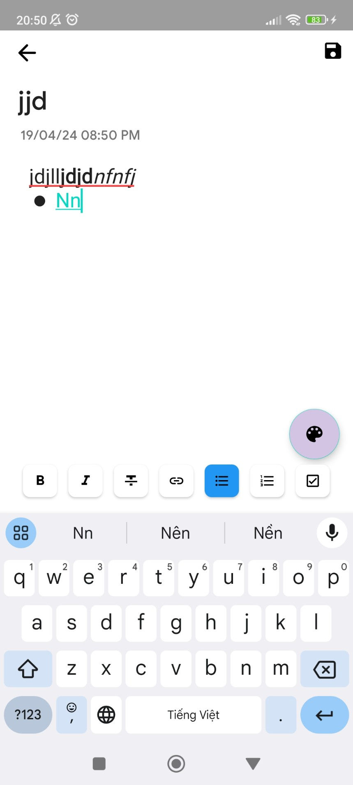</td>
      <td>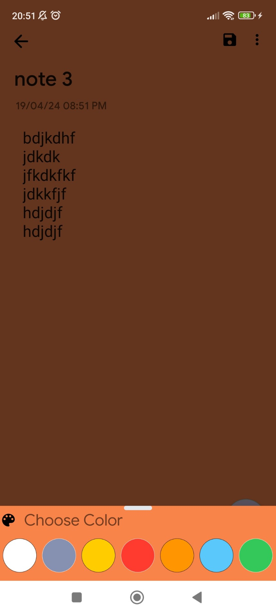</td>
      <td>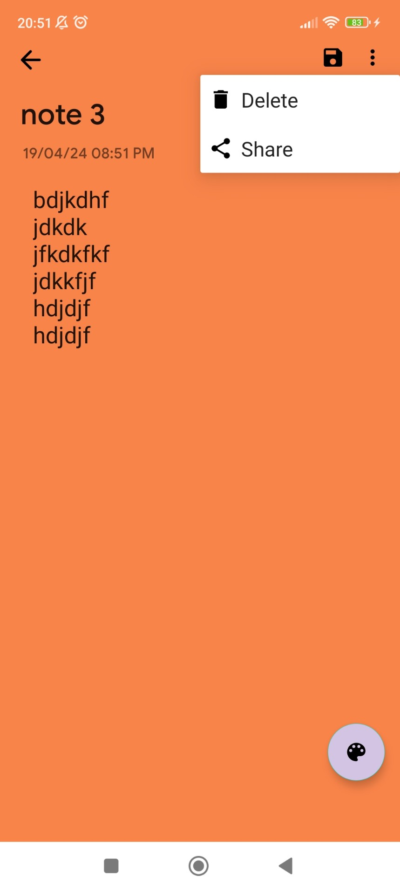</td>
    </tr>
    <tr>
      <th></th>
      <th></th>
      <th></th>
      <th></th>
    </tr>
    <tr>
      <td>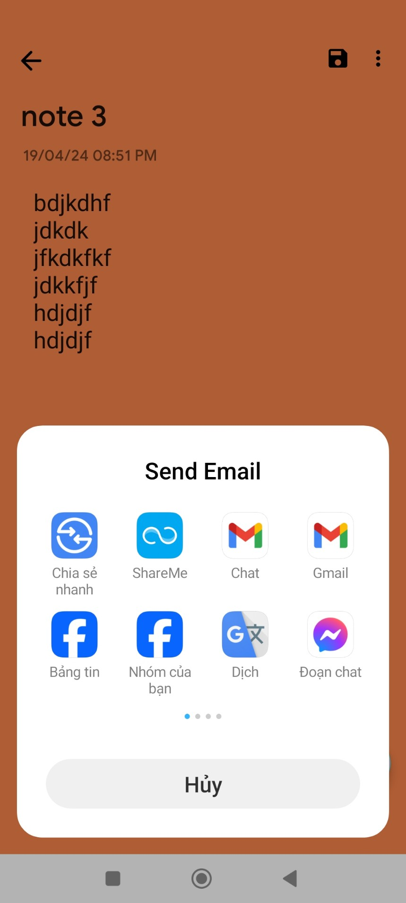</td>
      <td></td>
      <td>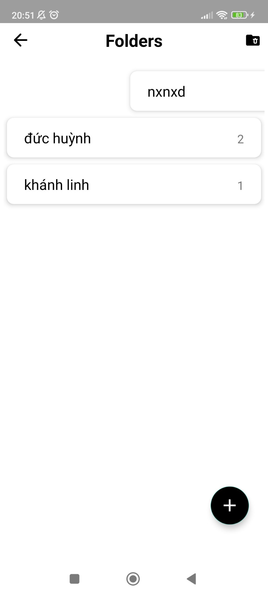</td>
      <td>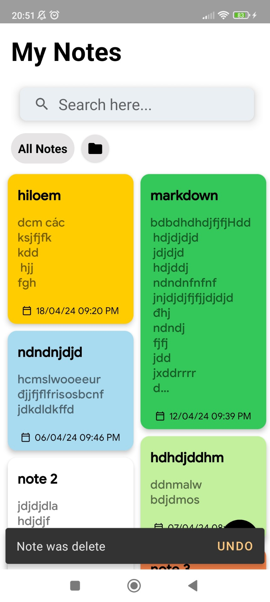</td>
    </tr>
    <tr>
      <th></th>
      <th></th>
      <th></th>
    </tr>
    <tr>
      <td>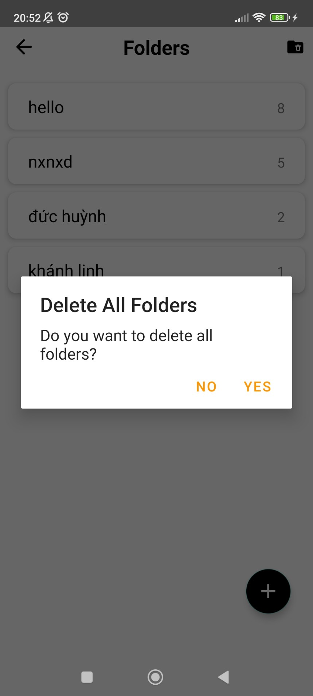</td>
      <td>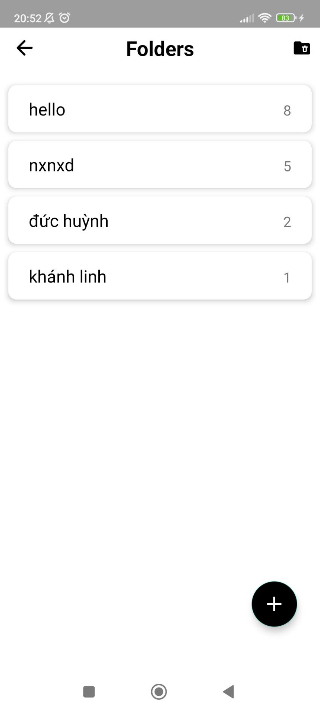</td>
      <td>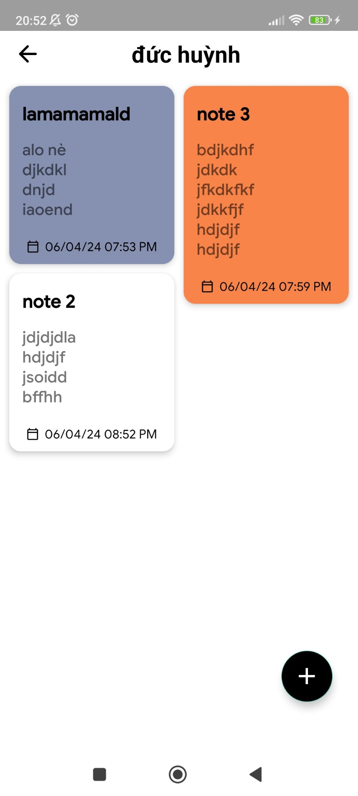</td>
    </tr>
  <table/>
  
# Features
- CRUD Notes
- CRUD Folder
- Using Room Database
- MVVM
- Navigation
- Spectrum
- Markdownedittext

For Feedback or Suggestions Mail Me At huynhtrongduc01225445811@gmail.com 
